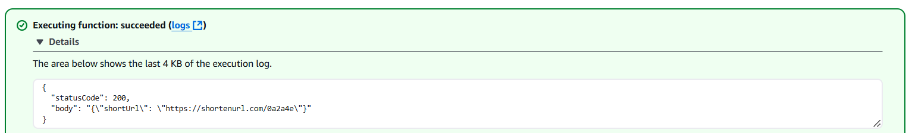
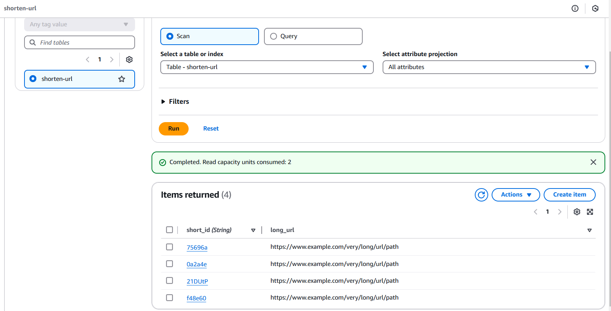

# URL-shortner-store-to-DynamoDB

This will shorten the URL with unique ID generation and stores the unique ID along with the coressponding long url.

# Requirements

1. DynamoDB
2. Lambda with required permissions.

# Test results.

Post execution:

*ShortURL OutPut*:

*DynamoDB Entries*

